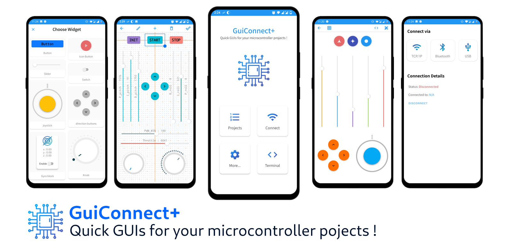

# GuiConnectHelper library
This is a helper library for **[GuiConnect+: a quick GUI creator for microcontroller projects](https://play.google.com/store/apps/details?id=com.zmdev.protoplus)**


__________

# Tutorials
* [Getting started with GuiConnect+: blinky example](https://github.com/zakimadaoui/GuiConnectHelper/blob/master/docs/Getting%20started%20with%20GuiConnect%2B.md)
* [Creating custom commands and using constant parameters with a servo robot arm example](https://github.com/zakimadaoui/GuiConnectHelper/blob/master/docs/GuiConnect%2B%20tutorial%20II:%20custom%20commands.md)

# Demo
* [Demo video for GuiConnect+](https://github.com/zakimadaoui/GuiConnectHelper/blob/master/docs/Getting%20started%20with%20GuiConnect%2B.md)

# GuiConnectHelper Documentation

## GCH_init()

### Description
Constructor function to initialize the state and register the callback function.  

### Syntax
```c
void GCH_init(GuiConnectHelper* handle, GCHCallbackHandler callback)
```

### Parameters
**handle:** a pointer to a GuiConnectHelper instance.  
**callback:** pointer to a callback function which is called each time a command is fully recieved.

### Example Code
```c
#include"GuiConnectHelper.h"

GuiConnectHelper gcHandle;
void onCommandRecieved(){
    //callback code here
}

void setup(){
    //init and register the callback
	GCH_init(&gcHandle, onCommandRecieved);
}
```
__________


## GCH_loadNextbyte()

### Description
This function must be called every time some new bytes are received from the GuiConnect+ application. You should use this in your super loop if there is no blocking code inside, or preferably in an ISR (like a UART isr), Or use a separate task for it if you are using an RTOS.   

### Syntax
```c
void GCH_loadNextbyte(GuiConnectHelper* handle, uint8_t byte)
```

### Parameters
**handle:** a pointer to a GuiConnectHelper instance.  
**byte:** a byte received from GuiConnect+ application through a certain connection (TCP/IP, UART, BT).
### Example Code
```c
void loop(){
	//load any newly available data from serial
	while(Serial.available()) {
        GCH_loadNextbyte(&gcHandle, Serial.read());
    }

    //other non blocking code......
}
```
__________

## GCH_GetStrCommandName()

### Description
This must be called within the callback function. It returns the received command name as a character sequence (string). Please do not call free() on the returned data.

### Syntax
```c
char* GCH_GetStrCommandName(GuiConnectHelper* handle);
```

### Parameters
**handle:** a pointer to a GuiConnectHelper instance.  

### Example Code
```c
#include "string.h"
void onCommandRecieved(){

	char* cmdName =  GCH_GetStrCommandName(&gcHandle);
	if(strcmp(cmdName, "cmd-name1") == 0){
		//do something
	}
    else if(strcmp(cmdName, "cmd-name2") == 0){
		//do something
	}//......
}
```
__________

## GCH_GetCharCommandName()

### Description
Same as the previous one, but returns a single character instead of a string. This is very useful if all your commands use a single character as a command name.
### Syntax
```c
char GCH_GetCharCommandName(GuiConnectHelper* handle);
```

### Parameters
**handle:** a pointer to a GuiConnectHelper instance.  

### Example Code
```c
void onCommandRecieved(){

	char cmdName = GCH_GetCharCommandName(&gcHandle)
	
	switch (cmdName){
		case 'k': // a knob was rotated
			/*do something...*/
			break;

		case 'b': // a button was clicked
			/*do something...*/
			break;

		case 's': // a switch was toggled
			/*do something...*/
			break;

		/*and so on ....*/

	}
  
}
```
__________

## GCH_getParamsNbr()

### Description
returns the nbr of parameters of the received command. 

### Syntax
```c
uint8_t GCH_getParamsNbr(GuiConnectHelper *handle)
```

### Parameters
**handle:** a pointer to a GuiConnectHelper instance.  

### Example Code
```c
int paramsNbr = GCH_getParamsNbr(&gcHandle);
```
__________


## GCH_GetParamAsInt()
## GCH_GetParamAslong()
## GCH_GetParamAsChar()
## GCH_GetParamAsString()
## GCH_GetParamAsFloat()

### Description
returns one of the received command's parameters. The return type depends on which function is called. In order to know which datatype you should use always refer to the widget documentation specified in the GuiConnect+ app.  

### Syntax
```c
int     GCH_GetParamAsInt(GuiConnectHelper* h, uint8_t param_index);
long    GCH_GetParamAslong(GuiConnectHelper* h, uint8_t param_index);
char    GCH_GetParamAsChar(GuiConnectHelper* h, uint8_t param_index);
char*   GCH_GetParamAsString(GuiConnectHelper* h, uint8_t param_index);
float   GCH_GetParamAsFloat(GuiConnectHelper* h, uint8_t param_index);

```

### Parameters
**h:** a pointer to a GuiConnectHelper instance.  
**param_index:** index of the desired command parameter. Note that the first index is always 0.

### Example Code
```c
void onCommandRecieved(){

	char cmdName = GCH_GetCharCommandName(&gcHandle); 
    int angle, servoIndex;
	
	switch (cmdName){
		case 'k': // a knob is rotated
			servoIndex = GCH_GetParamAsInt(&gcHandle, 0); //get parameter 0 as an integer value
			angle = GCH_GetParamAsInt(&gcHandle, 1); //get parameter 1 as an integer value
			servo[servoIndex].write(angle);
			break;

		/*other cases ....*/

	}
  
}
```
__________


TODO: add license + demo video
