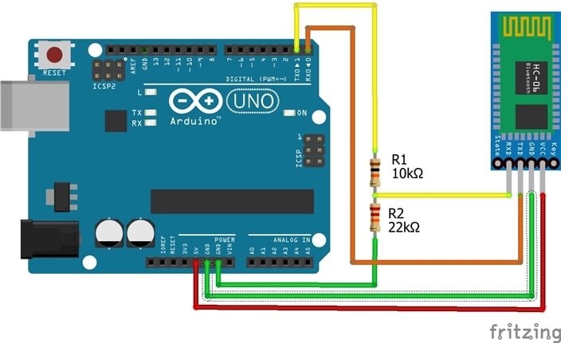
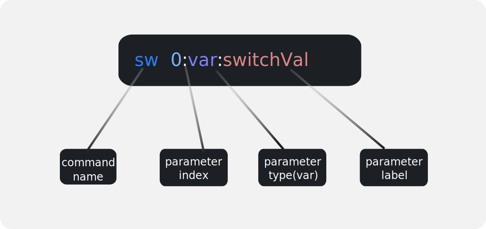

# Getting started with GuiConnect+: quick GUIs for your micro-controller projects


# Introduction

**GuiConnect+** is an android app that allows you to quickly set up a graphical interface and communicate with your microcontroller wirelessly (TCP/IP and Bluetooth) or via UART. The GUIs can be built quickly using **drag-and-drop** widgets like Buttons, Slider, Joysticks and Knobs, or you can extend the functionalities of you project by using sensor blocks and take advantage of the various sensors of your device.

The widgets send data to the microcontroller as **commands**, which can be customized from the app. Then, the **GuiConnectHelper** C/C++ library is used to interpret the commands and convert them into a list of variables for the user, as well as generate callbacks when a command is fully received. The library is also **platform-independent**, i.e you can use it with any framework (Arduino, ESP IDF ,STM32 …) or even go bare-metal !

**NB:** Throughout this series of tutorials, the **Arduino Framework** will be used out of convenience, popularity and ease of use. However, you can easily port the codes shown in the examples to any framework you want.

# Hello world with GuiConnect+ (blinky)

### Hardware

- Arduino UNO or any other Board
- HC-06 Bluetooth module (or similar)

### Wiring



**NB:** don't forget to disconnect the Rx and Tx pins while uploading your code !

### Creating the Graphical Interface

Let's say you want to create a simple GUI that connects over **Bluetooth** with your Arduino board and control the blinking of an LED. We will need a **switch widget** to START/STOP the blinking, and we need a **slider widget** to vary the blinking speed. So, let's create that GUI !

- **Step 1:**  open the app -> projects and tape the [+] button to create a new project, give your new project a name (ex: blinky) and click “**create project**”
- **Step2:** Press the GUI button -> Open the editor (top right icon) and add a new **switch** widget -> give it a label “blink ?” and press the [+] button to add the widget to the UI.
- **Step3:** Similarly add a **slider** widget, modify its max value to 1000 instead of 100. Press the [+] button and position this widget below the switch.
- **Step4:** Press the back arrow -> save changes and hey presto ! the GUI is done.
- You can also follow the above steps through this video:

<!-- 


 -->

[](http://www.youtube.com/watch?v=sR-VkSSe_jY "GuiConnect+: blinky GUI example")

**Note:** you can press the **[<>]** button to see the output command of a widget once you interact with it.

**What happens when a widget is presses or used ?**

Whenever the user interacts with a certain widget like a switch or a slider, a **command** will be sent to the connected device (we haven’t connected to the board yet, but that’s the next step).

The **commands**  sent will have the following format:

```jsx
>command_name, param0, param1……<
```

- a **command_name** can be used as an identifier for what the command does. For example, a command_name = "sl" means a command from a slider was sent.

- **parameters** like param0 and param1 are used to send additional data like the progress of a slider or a constant number indicating which slider is being changed (in the case of multiple sliders)

The user can create custom commands and link them to the desired widgets. However, all widgets have default commands linked to them initially. For example, the widgets chosen in this example have the following default commands:

**Switch  widget command:** 

```jsx
>sw,(0 or 1)< 
```

The string “sw” is the **command name** that indicates a switch is toggled and **parameter 0** is a variable integer value that can either be 0 or 1 which is the value of the switch widget.


The app displays commands in a similar and more expressive fashion as follows:



 


**Slider  widget command:** 

```jsx
>sl,(0 to 1000)< 
```

The string “**sl**” is the **command name** that indicates that the slider is dragged. **Parameter 0** is an integer variable that changes value between 0 and 1000 depending on how the user interacts with the slider widget.


Custom commands will be discussed in the next tutorial.


# GuiConnectHelper library & Arduino code

Now that we know which and how data is going to be sent to the microcontroller, we need a way to convert it from a stream of bytes into a set of variables that we can use in our program. For that we use the **GuiConnectHelper** C/C++ library that can parse the received commands efficiently and provide an API to read the *command_name* and *parameters* within a *callback*. 

You can download it from this **GitHub** page as a .zip file, then include it into your Arduino libraries as **shown here.**

Let's write some code !

1. First create an instance of **GuiConnectHelper** and call it for example *gcHandle*.
2. Then, call the *GCH_init(…)* function in your setup code and pass the **callback** function to it. 
3. In order for the library to parse the received data, the program needs to continuously load incoming bytes by calling the *GCH_loadNextByte(…)* function (more on that later).

**The code** 

```arduino
#include"GuiConnectHelper.h"
#include"string.h"

GuiConnectHelper gcHandle;
int switchVal = 0; //switch value for enabling/disabling blinking
int sliderVal = 100; //slider value holds blinking delay in milliseconds
long prev = 0;
long time_diff;

void onCommandRecieved(); //callback

void setup(){
  //init and register callback
	GCH_init(&gcHandle, onCommandRecieved);
  
	pinMode(13, OUTPUT);
	Serial.begin(9600);


	Serial.println("hello world");
	// some bluetooth modules need to recieve data at first to start
	// working properly. so we send a "hello world" message.
	// you'll need to reset the board after BT connection for this message to be sent
	
	prev = millis();
}

void loop(){
	//load any newly available data
	while(Serial.available()) GCH_loadNextbyte(&gcHandle, Serial.read());

	//blink (non-blocking)
	if(switchVal){
	    blinkLED();
	}
	else{
		digitalWrite(13, LOW); //turn off blinking
	}
}

void blinkLED(){
  
    time_diff = millis() - prev;
  
    if( time_diff <= sliderVal)
      digitalWrite(13, HIGH);
    else if(time_diff > sliderVal && time_diff <= 2*sliderVal)
      digitalWrite(13, LOW);
    else
      prev = millis();
}

void onCommandRecieved(){
	// this is a callback that triggers whenever a command is fully recived
	// and parsed. You can use the gcHandle object to retrieve the command_name
	// and parameters
	char* cmdName =  GCH_GetStrCommandName(&gcHandle);
	if(strcmp(cmdName, "sw") == 0){
		switchVal = GCH_GetParamAsInt(&gcHandle,/*param index*/0); //get parameter 0 as an integer value
	}
  else if(strcmp(cmdName, "sl") == 0){
		sliderVal = GCH_GetParamAsInt(&gcHandle,/*param index*/0); //get parameter 0 as an integer value
	}


  //NOTES:
  // - avoid blocking calls like 'delay()' inside this callback
	// - do not call free() on cmdName or anything library related, the library takes care of that
	// - command name and parameters must only be accessed within this callback
  // trying to access them outside of it will lead undesired behaviour
}
```


**Remark:** Notice that the **delay()** function was avoided inside the **loop()**, and this is because we want to read incoming bytes as soon as they arrive, and by calling **delay()**, the loop will block, and no data can be received during that time until the delay ends. And that will cause a LAG between what the user is specifying from the GUI and what the MCU actually does in action to that, as data is not being read as soon as it arrives. So either:
- You must have your loop code non-blocking 
- OR use interrupts to receive data and call the *GCH_loadNextByte(…)* function within an ISR
- OR if you are using an RTOS, allocate a task to receive data as frequently as possible.


# Connecting via Bluetooth

- **Step1:** go to the app’s home page →connections →choose **BT**.

- **Step2:** a dialog will appear, choose "SHOW PAIRED DEVICES", and enable Bluetooth if not enabled yet.

- **Step3:** If you have already paired your HC-06 module with your phone, it will show up in the list of paired devices, otherwise you have to pair it from your phone's Bluetooth settings.

- You can also follow the above steps through this video:

[](http://www.youtube.com/watch?v=ggdZiZjV7q4 "GuiConnect+: BT connection")

Once you're connected, and the previous code is uploaded, you can navigate to projects, open the GUI and try it out ! 

**NB:** you may need to reset your board for the code to work properly.

[](http://www.youtube.com/watch?v=am1MPolhVFg "GuiConnect+: testingblinky GUI")
# Next tutorial:
- Creating and using custom commands in GuiConnect+
