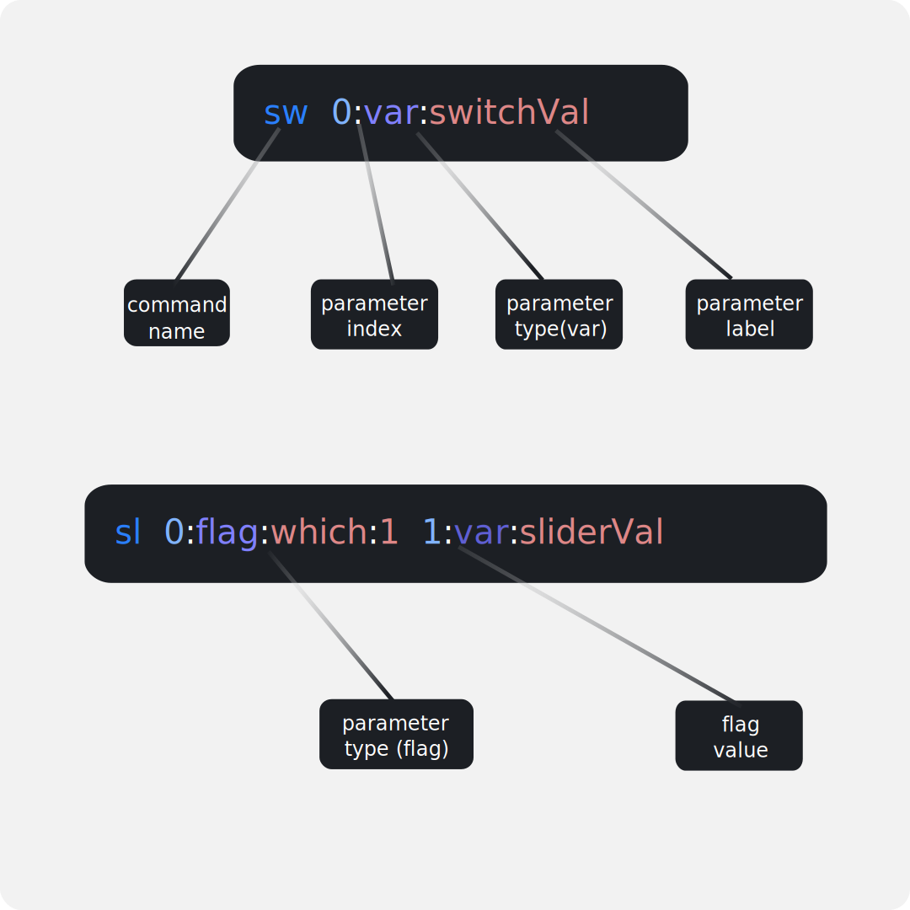
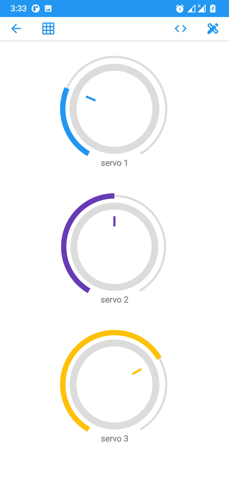

# GuiConnect+ tutorial II : custom commands

In the previous tutorial we have seen how to setup a simple GUI in **GuiConnect+** and how to receive and interpret the **default commands** of its widgets using the **GuiConnectHelper library**.

Of course, in such simple applications where there is one widget of each type, using the default command for each widget is sufficient to get your project up and running. However, when your GUI starts to get complicated and you start to have multiple widgets of the same type (like a couple of sliders), then you will have to create your own custom commands to be able to distinguish between the different components. Or if you want to force certain widgets to have a specific **command name**.

In this tutorial we will see how you can create custom commands for widgets, where you can specify your desired **command name** as well as be able to add **constant parameters** which could be used to distinguish between similar widgets while keeping the same **command name**.

# GuiConnect+ command format



- **command name:**  could be used to identify the widget's type, or the function of the widget. For instance *command_name=”sl”* indicates that this command is coming from a slider. Or  *command_name=”start”* could be a signal to start a certain process.
- **constant parameters:** can hold constant values specified by the user which can be used for distinguishing widgets of the same type, while linking them to commands that have the same command name (example shown later)
- **variable parameters:** used by the widget to insert its value into them. The user must create exactly the number that the widget requires.
- **Parameter labels:** labels could be the names of the variables used in your code. They are optional details which help you identify what each parameter does.

# Practical example: controlling a 3R servo robot arm.

Let’s say that you have just finished 3D printing one of those servo based robot arms, and you want to bring it to life ! One way to control it is to wire up a few noisy potentiometers to your controller board and control the individual servo motors using those pots. Or even better, you can use GuiConnect+ to build a quick GUI for it and save some space on your desk while you  enjoy playing with that robot arm wirelessly. So, let’s build that GUI !

While there are several widgets such as sliders, and joysticks that could be used to control our servo motors. The **knob** widget is the closest one to a potentiometer, so we are going to use 3 of those to control our 3 servo motors. 




If we drag and drop 3 knobs directly into the canvas and save that GUI, the 3 widgets will have the same **default command.**  However, we don’t want that to happen as we won’t be able to tell which knob is being rotated, since they all will sent the same **command name.** Instead, we want to create our own custom commands with 3 different command names, then link them to the appropriate widgets. This video shows how that could be done:


[](http://www.youtube.com/watch?swxpUSAc8as "GuiConnect+: robot arm example")

**Note:** keep in mind that the KNOB widget requires the custom command to have a single variable parameter. If you want to know how many variable parameters your widget needs, then you can click on “open widget documentation” button when adding a new widget. The widget documentation dialog also tells you the datatype that you need to use to store the value of the variable parameters. 

### Code for receiving and using the commands

So these are the three commands that we need to receive in the MCU side:


The following code can be used to receive the commands and control the robot arm servos. The same code can be found also in the examples section in the ArduinoIDE if the library is installed properly.

```c
#include"GuiConnectHelper.h"
#include"string.h"
#include"Servo.h"

GuiConnectHelper gcHandle;
Servo servo[3];

void onCommandRecieved(); //callback

void setup(){
  //init and register callback
	GCH_init(&gcHandle, onCommandRecieved);

  //attach the servos
	servo[0].attach(5);
  	servo[1].attach(6);
  	servo[2].attach(7);

  Serial.begin(9600);
	Serial.println("hello world");
	// some bluetooth modules need to recieve data at first to start
	// working properly. so we send a "hello world" message.
	// you'll need to reset the board after BT connection for this message to be sent
}

void loop(){
	//load any newly available data
	while(Serial.available()) GCH_loadNextbyte(&gcHandle, Serial.read());
}

void onCommandRecieved(){
	// this is a callback that triggers whenever a command is fully recived
	// and parsed. You can use the gcHandle object to retrieve the command_name
	// and parameters

 
	char* cmdName =  GCH_GetStrCommandName(&gcHandle);
    int angle;
  
	if(strcmp(cmdName, "k1") == 0){ //knob1 is rotated
		angle = GCH_GetParamAsInt(&gcHandle,/*param index*/0); //get parameter 0 as an integer value
		servo[0].write(angle);
	}
  	else if(strcmp(cmdName, "k2") == 0){ //knob2 is rotated
		angle = GCH_GetParamAsInt(&gcHandle,/*param index*/0); //get parameter 0 as an integer value
		servo[1].write(angle);
 	}
  	else if(strcmp(cmdName, "k3") == 0){ //knob3 is rotated
		angle = GCH_GetParamAsInt(&gcHandle,/*param index*/0); //get parameter 0 as an integer value
		servo[2].write(angle);
 	}

  //NOTES:
  // - avoid blocking calls like 'delay()' inside this callback
  // - do not call free() on cmdName or anything library related, the library takes care of that.
  // - command name and parameters must only be accessed within this callback
  //   trying to access them outside of it will lead undesired behaviour
}
```

## Improvements with using constant parameters

Notice that the code inside the *onCommandRecieved()* callback function is not very efficient. We can improve that by changing the structure of our commands. Instead of using different **command names** for every knob, we can instead give them all the same command name, then we introduce a **constant parameter** for each command to indicate which motor we want to rotate.  The following video shows how that could be done.

[](http://www.youtube.com/watch?S0pIVtJqQJY "GuiConnect+: constant parameters example")


Now that the structure of our commands has changed, we also need to modify our code to accommodate for that. The only part that needs to be changed is within the callback:

```c
void onCommandRecieved(){

	char cmdName = GCH_GetCharCommandName(&gcHandle); 
  
	if(cmdName == 'k'){ // a knob is rotated
    int servoIndex = GCH_GetParamAsInt(&gcHandle, 0); //get parameter 0 as an integer value
    
	int angle = GCH_GetParamAsInt(&gcHandle, 1); //get parameter 1 as an integer value
    servo[servoIndex].write(angle);
	}
}
```

Notice that this time we used the function *GCH_GetCharCommandName(…)* instead of  *GCH_GetStrCommandName(…)* since the command name is a single character and not a string, and that simplifies the code even further. Also, by using a character as a command name for different types of widgets, you can simply use a **switch-case statement** to make your code even neater, for example:

```c
void onCommandRecieved(){

	char cmdName = GCH_GetCharCommandName(&gcHandle); 
    int angle, servoIndex;
	
	switch (cmdName){
		case 'k': // a knob is rotated
			servoIndex = GCH_GetParamAsInt(&gcHandle, 0); //get parameter 0 as an integer value
			angle = GCH_GetParamAsInt(&gcHandle, 1); //get parameter 1 as an integer value
			servo[servoIndex].write(angle);
			break;

		case 'b': // a button was clicked
			/*do something...*/
			break;

		case 's': // a switch was toggled
			/*do something...*/
			break;

		/*and so on ....*/

	}
  
}
```